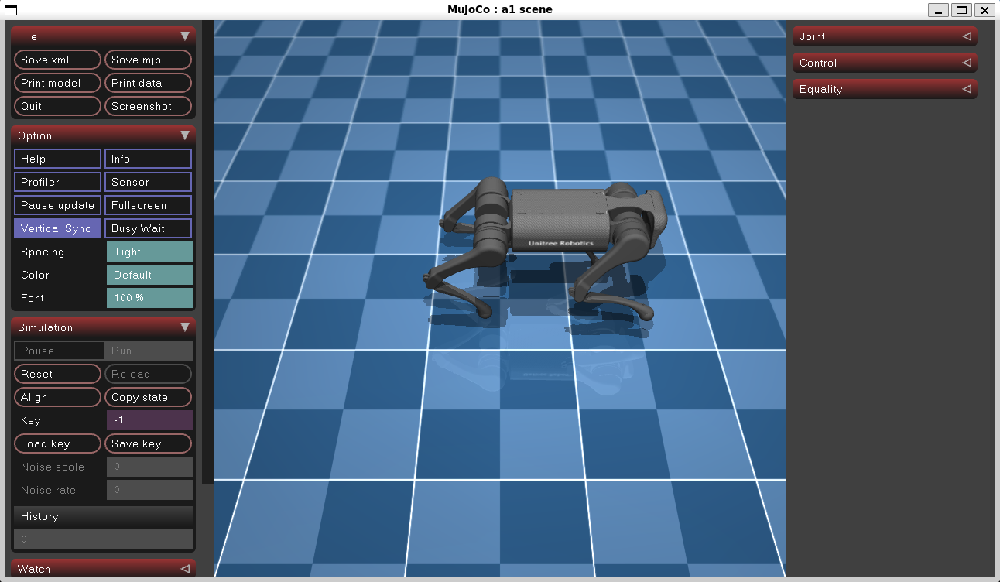

# Unitree A1 Quadruped Locomotion using Reinforcement Learning

## Overview

This project was carried out during my internship at **ISRO – Satish Dhawan Space Centre (SDSC SHAR), Sriharikota**, under the **Liquid Propellant Storage & Servicing Facilities (LSSF)** division.

The objective of this project was to develop and demonstrate **stable trot gait locomotion** for the **Unitree A1 Quadruped Robot** using **Reinforcement Learning (RL)** in the **MuJoCo simulation environment**.

The project utilizes **Proximal Policy Optimization (PPO)** along with a **Curriculum Learning** approach, where the robot progressively learns increasingly complex locomotion behaviors through multiple training stages.

---

## Internship Details

**Organization:** ISRO – SDSC SHAR, Sriharikota

**Division:** Liquid Propellant Storage & Servicing Facilities (LSSF)

**Duration:** May 2026 – June 2026

**Project Title:**
*Trot Gait Locomotion of Unitree A1 Quadruped Robot using Reinforcement Learning*

---

## Project Objective

The primary goal of this project is to train a simulated Unitree A1 quadruped robot to achieve stable and coordinated trot gait locomotion using Reinforcement Learning.

Key objectives include:

- Learning stable quadruped locomotion
- Developing coordinated diagonal-leg trot gait behavior
- Improving gait symmetry and stability
- Reducing unwanted yaw and body oscillations
- Achieving smooth forward locomotion on flat terrain

---

## Simulation Environment



The project was developed and evaluated using the **MuJoCo Physics Simulator**.

The Unitree A1 robot is simulated on a flat terrain environment where the RL agent learns locomotion through interaction with the environment and reward-based optimization.

### Features

- Physics-based simulation
- Joint-level control
- Ground contact modeling
- Real-time visualization
- Reinforcement Learning training and evaluation

---

## Reinforcement Learning Approach

### Algorithm

- **Proximal Policy Optimization (PPO)**
- Framework: **Stable-Baselines3**

### Learning Strategy

A **Curriculum Learning** framework was adopted to gradually improve locomotion performance.

The robot progresses through four training stages, where reward shaping and gait constraints are progressively refined.

---

## Curriculum Learning Stages

### Stage 1 – Initial Locomotion Learning

- Basic locomotion learning
- Reference-motion guidance
- Progressive speed curriculum
- Stability-focused rewards

### Stage 2 – Gait Symmetry and Stability

- Improved diagonal gait coordination
- Enhanced gait symmetry rewards
- Yaw stabilization improvements
- Better directional movement

### Stage 3 – Force Symmetry Learning

- Introduced force symmetry tracking
- Balanced propulsion between diagonal leg pairs
- Reduced uneven force generation
- Improved coordination consistency

### Stage 4 – Final Trot Gait Optimization

- Refined reward shaping
- Stronger symmetry constraints
- Improved yaw control
- Stable forward trot gait locomotion

---

## Project Structure

```text
Unitree-A1-trotgait-RL/
│
├── assets/
│
├── a1.xml
├── scene.xml
│
├── requirements_rl.txt
│
├── rl_env_stage1.py
├── rl_env_stage2.py
├── rl_env_stage3.py
├── rl_env_stage4.py
│
├── train_stage1.py
├── train_stage2.py
├── train_stage3.py
├── train_stage4.py
│
├── test_stage1.py
├── test_stage2.py
├── test_stage3.py
├── test_stage4.py
│
└── README.md
```

---

## Requirements

### Python Version

- Python 3.12

### Main Dependencies

```txt
numpy==2.4.6
gymnasium==1.2.3
mujoco==3.9.0
stable-baselines3==2.8.0
torch==2.12.0
```

Install dependencies using:

```bash
pip install -r requirements_rl.txt
```

---

## Running the Project

### Option 1: Run Using Pretrained Models

After downloading and extracting the project files and installing the dependencies:

```bash
python test_stage4.py
```

This loads the final trained policy and demonstrates the learned trot gait locomotion.

---

### Option 2: Train from Scratch

Run the training stages sequentially:

```bash
python train_stage1.py
python train_stage2.py
python train_stage3.py
python train_stage4.py
```

Optional evaluation after each stage:

```bash
python test_stage1.py
python test_stage2.py
python test_stage3.py
python test_stage4.py
```

The final locomotion result can be observed using:

```bash
python test_stage4.py
```

---

## Results

### Final Outcome

The trained PPO agent successfully demonstrates:

- Stable quadruped locomotion
- Coordinated trot gait behavior
- Improved gait symmetry
- Reduced yaw deviation
- Consistent forward movement
- Physics-based locomotion in MuJoCo

---

## Skills Gained

During this project, the following concepts and tools were explored:

- Reinforcement Learning
- Proximal Policy Optimization (PPO)
- Curriculum Learning
- Robotics Simulation
- MuJoCo Physics Engine
- Quadruped Robot Locomotion
- Reward Engineering
- Python Development
- Linux (Ubuntu)
- Stable-Baselines3

---

## Acknowledgements

This project was completed as part of my internship training at:

**ISRO – Satish Dhawan Space Centre (SDSC SHAR), Sriharikota**

I would like to express my sincere gratitude to my guide and the LSSF division for providing the opportunity to learn and work on reinforcement learning-based quadruped locomotion.

---

## Author

**Aishwarya Pragada**

B.Tech Computer Science & Engineering (Artificial Intelligence)

Amrita Vishwa Vidyapeetham, Amaravati

Aspiring AI Engineer
